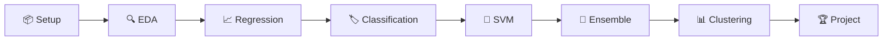

<div align="center">


# 🤖 Praktikum Applied Machine Learning

### *Membangun Fondasi AI dengan Pendekatan Hands-On*

**Laboratorium Informatika**  
**Fakultas Teknik - Universitas Muhammadiyah Makassar**

---

[](https://github.com/devnolife)

</div>

---

## 📋 Informasi Mata Kuliah

| Atribut | Detail |
|---------|--------|
| **Kode Mata Kuliah** | `CW6552021547` |
| **Semester** | V (Lima) |
| **SKS** | 3 SKS |
| **Program Studi** | Informatika |
| **Fakultas** | Teknik |
| **Universitas** | Universitas Muhammadiyah Makassar |

---

## 📘 Deskripsi

> Repositori ini berisi materi praktikum **Applied Machine Learning** yang dirancang untuk memberikan pemahaman mendalam tentang prinsip-prinsip inti dan aplikasi dari *supervised learning*, *unsupervised learning*, dan *reinforcement learning*. Mahasiswa akan menggunakan pustaka Python standar industri seperti **scikit-learn** untuk memecahkan masalah dunia nyata.

## 🎯 Capaian Pembelajaran

<table>
<tr>
<td>

| No | Capaian |
|----|---------|
| 1 | Memahami dan mengimplementasikan algoritma **supervised learning** (regresi, klasifikasi) |
| 2 | Menguasai teknik **unsupervised learning** (clustering, dimensionality reduction) |
| 3 | Mampu menerapkan **reinforcement learning** untuk problem-solving |
| 4 | Menggunakan **scikit-learn** dan library Python untuk machine learning |
| 5 | Melakukan **evaluasi model** dan optimasi hyperparameter |

</td>
</tr>
</table>

## 📚 Roadmap Pembelajaran

> Materi dirancang untuk **8 pertemuan** dengan pendekatan *progressive learning*



| Pertemuan | Topik | Materi Utama | Status |
|:---------:|-------|--------------|:------:|
| **01** | [Python untuk ML & Setup Environment](./pertemuan-01) | Install tools, NumPy, Pandas, Matplotlib, Jupyter Notebook | 🟢 |
| **02** | [Data Preprocessing & EDA](./pertemuan-02) | Cleaning, normalisasi, visualisasi, handling missing values & outliers | 🟢 |
| **03** | [Linear & Polynomial Regression](./pertemuan-03) | Simple/Multiple Linear Regression, prediksi harga rumah | 🟢 |
| **04** | [Classification](./pertemuan-04) | Logistic Regression, Decision Tree, klasifikasi dataset Iris | 🟢 |
| **05** | [Support Vector Machine](./pertemuan-05) | SVM dengan kernel tricks, parameter tuning | 🟢 |
| **06** | [Ensemble Methods](./pertemuan-06) | Random Forest, Gradient Boosting, prediksi churn | 🟢 |
| **07** | [Clustering](./pertemuan-07) | K-Means, Hierarchical Clustering, segmentasi pelanggan | 🟢 |
| **08** | [UTS: Mid-semester Project](./pertemuan-08) | Mini project ML end-to-end | 🎯 |

## 🚀 Quick Start

### Prerequisites

<details>
<summary>📋 Klik untuk melihat requirements</summary>

- ✅ Python 3.8 atau lebih baru
- ✅ Anaconda atau Miniconda (recommended)
- ✅ Jupyter Notebook atau JupyterLab
- ✅ Git (untuk clone repository)

</details>

### Installation

<details>
<summary>🔧 Step-by-step Installation</summary>

**1️⃣ Clone repository:**
```bash
git clone https://github.com/devnolife/ml-practicum.git
cd ml-practicum
```

**2️⃣ Buat virtual environment:**
```bash
# Menggunakan conda (recommended)
conda create -n ml-practicum python=3.10
conda activate ml-practicum

# Atau menggunakan venv
python -m venv ml-env
source ml-env/bin/activate  # Linux/Mac
ml-env\Scripts\activate     # Windows
```

**3️⃣ Install dependencies:**
```bash
pip install numpy pandas matplotlib seaborn scikit-learn jupyter notebook
```

**4️⃣ Jalankan Jupyter Notebook:**
```bash
jupyter notebook
```

</details>

### ☁️ Alternatif: Google Colab

> Tidak ingin install di local? Gunakan [Google Colab](https://colab.research.google.com/)!

```python
# Install library yang diperlukan di cell pertama
!pip install scikit-learn matplotlib seaborn
```

---

## 📖 Panduan Penggunaan

### Workflow Setiap Pertemuan

```
📖 Baca README.md → 💻 Ikuti Tutorial → 🧪 Experiment → ✅ Kerjakan Tugas
```

### Struktur Repository

```
📁 ml-practicum/
├── 📄 README.md                    # Dokumentasi utama
├── 📁 pertemuan-01/
│   ├── 📄 README.md               # Materi & tugas
│   └── 📓 [your_work].ipynb       # Notebook praktikum
├── 📁 pertemuan-02/
│   └── ...
└── 📁 pertemuan-08/
    └── 📄 README.md               # Guideline UTS
```

---

## 💻 Tech Stack

<div align="center">

| Technology | Purpose | Version |
|:----------:|---------|:-------:|
|  | Bahasa pemrograman utama | 3.10+ |
|  | Komputasi numerik | Latest |
|  | Data manipulation | Latest |
|  | Visualisasi data | Latest |
|  | Statistical visualization | Latest |
|  | Machine learning | Latest |
|  | Interactive development | Latest |

</div>

---

## 📊 Sistem Penilaian

<div align="center">

```
┌─────────────────────────────────────────────────────────┐
│                    DISTRIBUSI NILAI                      │
├─────────────────────────────────────────────────────────┤
│  ████████░░░░░░░░░░░░░░░░░░░░░░░░░░░░░░░  10% Kehadiran │
│  ██████████████████████████░░░░░░░░░░░░░  30% Tugas     │
│  ████████████████████░░░░░░░░░░░░░░░░░░░  25% UTS       │
│  ██████████████████████████████░░░░░░░░░  35% UAS       │
└─────────────────────────────────────────────────────────┘
```

</div>

| Komponen | Bobot | Keterangan |
|----------|:-----:|------------|
| 📋 Kehadiran & Partisipasi | 10% | Minimal kehadiran 75% |
| 📝 Tugas Mingguan | 30% | Weekly Labs |
| 📊 UTS | 25% | Mid-term Project |
| 🎯 UAS | 35% | Final Project & Presentation |

### ✅ Kriteria Kelulusan

- [x] Nilai akhir minimal: **60 (D)**
- [x] Kehadiran minimal: **75%** dari total pertemuan
- [x] Mengumpulkan minimal **75%** dari total tugas
- [x] Mengikuti UTS dan UAS

---

## 📝 Submission Guidelines

### Format Penamaan File

```
📄 NIM_Nama_PertemuanXX.ipynb
📄 NIM_Nama_PertemuanXX.pdf
```
> Contoh: `105841101521_JohnDoe_Pertemuan01.pdf`

### ✅ Checklist Sebelum Submit

- [ ] ✓ Semua cell sudah di-run dan ada output
- [ ] ✓ Code rapi dan ada komentar
- [ ] ✓ Ada interpretasi untuk setiap hasil
- [ ] ✓ Visualisasi jelas dan labeled
- [ ] ✓ File naming sesuai format

---

## 🔧 Troubleshooting

<details>
<summary>❌ Error saat import library</summary>

```bash
pip install --upgrade [nama-library]
```

</details>

<details>
<summary>❌ Jupyter Notebook tidak muncul</summary>

```bash
pip install --upgrade jupyter notebook
jupyter notebook --version
```

</details>

<details>
<summary>❌ Memory error saat train model</summary>

- Reduce dataset size
- Use `n_jobs=-1` untuk parallel processing
- Close aplikasi lain yang tidak digunakan

</details>

---

## 📚 Referensi & Resources

<details>
<summary>📖 Official Documentation</summary>

| Library | Link |
|---------|------|
| Scikit-learn | [scikit-learn.org](https://scikit-learn.org/stable/) |
| Pandas | [pandas.pydata.org](https://pandas.pydata.org/docs/) |
| NumPy | [numpy.org](https://numpy.org/doc/) |
| Matplotlib | [matplotlib.org](https://matplotlib.org/stable/contents.html) |

</details>

<details>
<summary>🎓 Learning Resources</summary>

- [Kaggle Learn](https://www.kaggle.com/learn)
- [Machine Learning Crash Course - Google](https://developers.google.com/machine-learning/crash-course)
- [Scikit-learn Tutorials](https://scikit-learn.org/stable/tutorial/index.html)

</details>

<details>
<summary>📊 Datasets</summary>

- [Kaggle Datasets](https://www.kaggle.com/datasets)
- [UCI Machine Learning Repository](https://archive.ics.uci.edu/ml)
- [Scikit-learn Built-in Datasets](https://scikit-learn.org/stable/datasets.html)

</details>

---

## 👥 Tim Pengembang

<div align="center">

### 🏛️ Laboratorium Informatika
**Fakultas Teknik - Universitas Muhammadiyah Makassar**

---

| Role | Nama |
|------|------|
| 👨‍💻 **Developer & Maintainer** | [@devnolife](https://github.com/devnolife) |
| 👨‍🏫 **Dosen Pengampu** | [Nama Dosen] |
| 👨‍🔬 **Asisten Praktikum** | [Nama Asisten] |

</div>

---

## 💡 Tips Sukses

<div align="center">

| 💪 | Tips |
|:--:|------|
| 1️⃣ | **Konsisten** - Kerjakan praktikum setiap minggu |
| 2️⃣ | **Praktek** - ML butuh banyak hands-on |
| 3️⃣ | **Experiment** - Coba parameter berbeda |
| 4️⃣ | **Dokumentasi** - Tulis penjelasan untuk code |
| 5️⃣ | **Bertanya** - Jangan malu untuk diskusi |
| 6️⃣ | **Collaborate** - Belajar bersama, tapi jangan plagiat |
| 7️⃣ | **Real World** - Cari dataset yang menarik |

</div>

---

## ⚠️ Catatan Penting

> [!WARNING]
> - Pastikan selalu **backup** pekerjaan Anda
> - **Deadline** adalah hard deadline
> - **Plagiarism** akan mendapat sanksi sesuai aturan universitas
> - Materi akan **terus diupdate**, pastikan pull latest changes

---

<div align="center">

## 🚀 Let's Start Learning!

Mulai dari [**Pertemuan 01**](./pertemuan-01) dan ikuti step-by-step tutorial.

**Happy Learning & Coding! 🎉**

---

### 📧 Kontak & Support

[](https://github.com/devnolife)
[](mailto:devnolife@gmail.com)

---

<sub>

**Laboratorium Informatika - Fakultas Teknik**  
**Universitas Muhammadiyah Makassar**  

---


**Last Updated:** December 2025 | **Version:** 2.0

Made with ❤️ by [devnolife](https://github.com/devnolife)

</sub>

</div>
